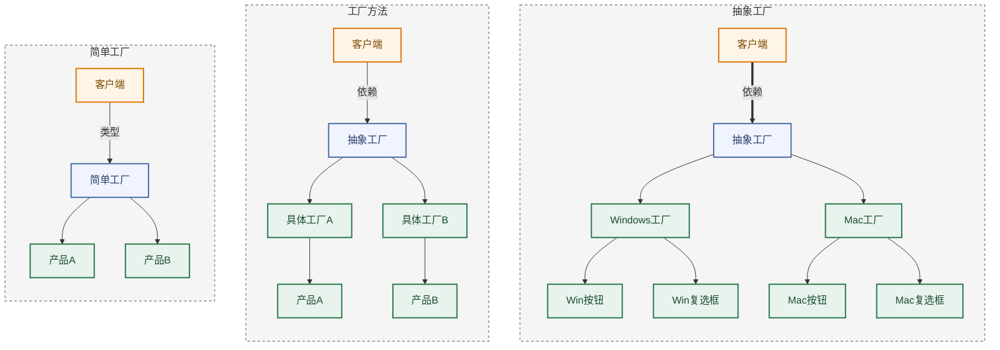

# 抽象工厂模式 <Badge text="常用" type="warning" />

抽象工厂模式（Abstract Factory Pattern） 是一种创建型设计模式，它提供了一种方式，可以将一组具有同一主题的单独的工厂封装起来。

### 优缺点

| 优点 | 缺点 |
| :--- | :--- |
| 确保同一工厂创建的产品属于同一系列，风格统一且能协同工作 | 需要定义大量接口和类，增加了系统的复杂度和维护成本 |
| 客户端仅依赖抽象接口，无需关心具体产品的类名和创建细节 | 若增加新的产品种类，需修改抽象工厂及所有具体工厂，违背开闭原则 |
| 更换整套产品（如切换 UI 主题）只需替换工厂实例，符合开闭原则 | |

**适用场景**

- 系统需要独立于其产品的创建、组合和表示方式
- 系统需要配置多个产品族中的一个
- 需要强调一系列相关产品对象的设计以便联合使用
- 提供产品类库，只暴露接口不暴露实现

### 抽象工厂 vs 工厂方法

| 模式 | 产品维度 | 实现方式 | 关注点 |
| :--- | :--- | :--- | :--- |
| 抽象工厂模式 | 产品族（多个产品） | 组合 | 产品间兼容性 |
| 工厂方法模式 | 单一产品 | 继承 | 单个产品创建 |

### 工厂对比



### 抽象工厂

```Java
// ================= 1. 定义抽象产品（两类不同的东西） =================
// 注意：这里有两个接口，代表两种不同类型的产品
interface Button { 
    void paint(); 
}

interface Checkbox { 
    void paint(); 
}

// ================= 2. 定义具体产品（Windows 家族） =================
// Windows 家族的按钮
class WinButton implements Button {
    public void paint() { System.out.println("绘制 Windows 风格按钮"); }
}
// Windows 家族的复选框
class WinCheckbox implements Checkbox {
    public void paint() { System.out.println("绘制 Windows 风格复选框"); }
}

// ================= 3. 定义具体产品（Mac 家族） =================
// Mac 家族的按钮
class MacButton implements Button {
    public void paint() { System.out.println("绘制 Mac 风格按钮"); }
}
// Mac 家族的复选框
class MacCheckbox implements Checkbox {
    public void paint() { System.out.println("绘制 Mac 风格复选框"); }
}

// ================= 4. 定义抽象工厂（核心！） =================
// 关键点：一个工厂接口里，声明了创建"多种"产品的方法
// 这就像一个"套餐菜单"，规定了这个工厂必须能生产按钮 AND 复选框
interface GUIFactory {
    Button createButton();      // 方法1：生产按钮
    Checkbox createCheckbox();  // 方法2：生产复选框
}

// ================= 5. 具体工厂（Windows 套餐工厂） =================
// 这个工厂专门负责生产"全套 Windows 风格"的产品
class WinFactory implements GUIFactory {
    public Button createButton() { 
        return new WinButton(); // 只能返回 Windows 按钮
    }
    public Checkbox createCheckbox() { 
        return new WinCheckbox(); // 只能返回 Windows 复选框
    }
}

// ================= 6. 具体工厂（Mac 套餐工厂） =================
// 这个工厂专门负责生产"全套 Mac 风格"的产品
class MacFactory implements GUIFactory {
    public Button createButton() { 
        return new MacButton(); // 只能返回 Mac 按钮
    }
    public Checkbox createCheckbox() { 
        return new MacCheckbox(); // 只能返回 Mac 复选框
    }
}

// ================= 7. 客户端使用 =================
public class Demo {
    public static void main(String[] args) {
        // 【核心优势体现】
        // 客户端只需要选择一个"工厂"（即选择一个主题/系列）
        // 一旦选定，后续创建的所有组件自动保持风格一致
        
        // 1. 实例化 Windows 工厂
        GUIFactory factory = new WinFactory(); 
        
        // 2. 从同一个工厂获取不同产品
        // 因为工厂是 WinFactory，所以 btn 一定是 WinButton，cb 一定是 WinCheckbox
        // 绝不会出现"Mac 按钮"配"Windows 复选框"的尴尬情况
        Button btn = factory.createButton();       
        Checkbox cb = factory.createCheckbox();    
        
        // 3. 使用产品
        btn.paint(); // 输出: 绘制 Windows 风格按钮
        cb.paint();  // 输出: 绘制 Windows 风格复选框
        
        // --- 如果想换风格，只需改一行代码 ---
        // GUIFactory factory = new MacFactory(); 
        // 剩下的代码不用动，出来的就全是 Mac 风格了
    }
}
```

### 经典应用

- **javax.xml.parsers.DocumentBuilderFactory**：JDK 中通过抽象工厂创建不同风格的 XML 解析器
- **Spring BeanFactory + BeanDefinition**：组合不同 Bean 定义实现创建逻辑，BeanFactory 作为抽象工厂
- **UI 主题框架**：如 Java Swing 的 LookAndFeel，通过切换工厂实现整套 UI 风格切换
