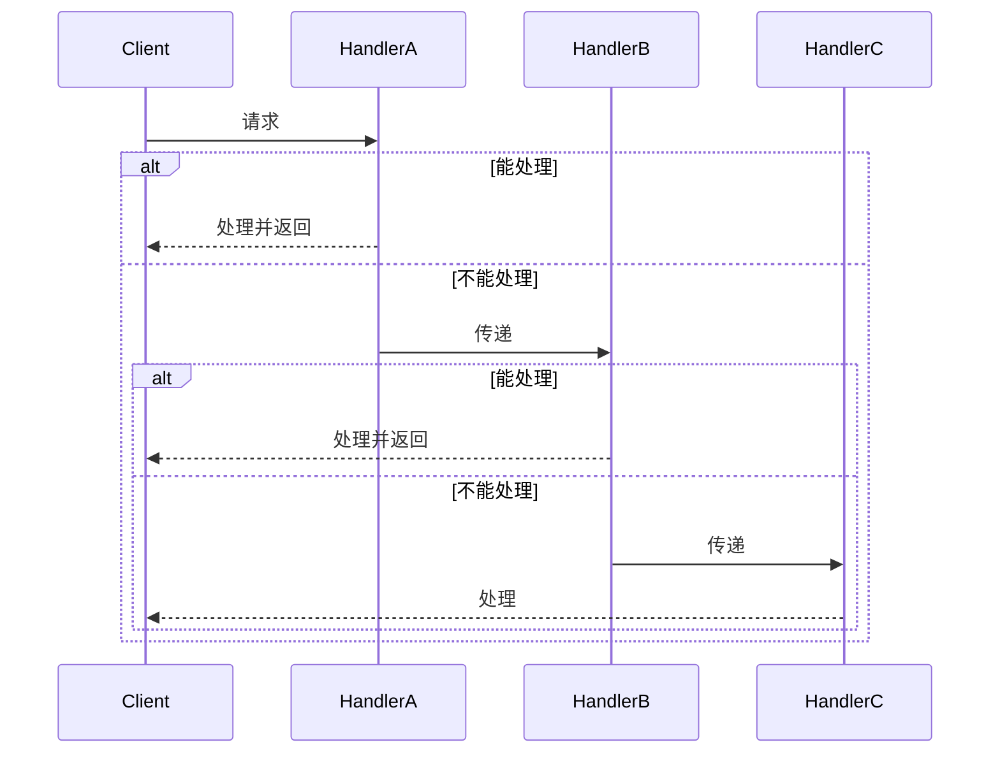

# 责任链模式 <Badge text="高频" type="danger" />

责任链模式（Chain of Responsibility Pattern）将多个处理器连成一条链，每个处理器独立决定是否处理请求，以及是否传递给下一个处理器。

### 优缺点

| 优点                                   | 缺点                                 |
| :------------------------------------- | :----------------------------------- |
| 请求的发送者和接收者（请求的处理）解耦 | 职责链太长或者处理时间过长，影响性能 |
| 职责链可以动态组合                     | 职责链可能过多                       |


**适用场景**

- 日志处理（Info→Debug→Error 多级输出）
- 审批流程（组长→经理→总监）
- 过滤器/拦截器链





### 实现

**基础责任链**

```Java
// 请假请求
class LeaveRequest {
    String name;
    int days;
    
    LeaveRequest(String name, int days) {
        this.name = name;
        this.days = days;
    }
}

// 审批人抽象类
abstract class Approver {
    protected Approver next;  // 下一个审批人
    
    void setNext(Approver next) {
        this.next = next;
    }
    
    void handleRequest(LeaveRequest request) {
        if (canApprove(request.days)) {
            approve(request);
        } else if (next != null) {
            System.out.println(getRole() + " 无权审批，转交上级...");
            next.handleRequest(request);
        } else {
            System.out.println("无人有权审批，请求被拒绝");
        }
    }
    
    abstract boolean canApprove(int days);
    abstract void approve(LeaveRequest request);
    abstract String getRole();
}

// 具体审批人：组长（权限 ≤ 3天）
class GroupLeader extends Approver {
    boolean canApprove(int days) { return days <= 3; }
    void approve(LeaveRequest r) { 
        System.out.println("组长批准了 " + r.name + " 请假 " + r.days + " 天");
    }
    String getRole() { return "组长"; }
}

// 主管（权限 ≤ 7天）
class Supervisor extends Approver {
    boolean canApprove(int days) { return days <= 7; }
    void approve(LeaveRequest r) { 
        System.out.println("主管批准了 " + r.name + " 请假 " + r.days + " 天");
    }
    String getRole() { return "主管"; }
}

// 经理（权限 ≤ 15天）
class Manager extends Approver {
    boolean canApprove(int days) { return days <= 15; }
    void approve(LeaveRequest r) { 
        System.out.println("经理批准了 " + r.name + " 请假 " + r.days + " 天");
    }
    String getRole() { return "经理"; }
}

// 使用
public class Demo {
    public static void main(String[] args) {
        // 组装责任链：组长 → 主管 → 经理
        GroupLeader leader = new GroupLeader();
        Supervisor supervisor = new Supervisor();
        Manager manager = new Manager();
        
        leader.setNext(supervisor);
        supervisor.setNext(manager);
        
        // 发起请假
        System.out.println("=== 请假1天 ===");
        leader.handleRequest(new LeaveRequest("张三", 1));
        
        System.out.println("\n=== 请假5天 ===");
        leader.handleRequest(new LeaveRequest("李四", 5));
        
        System.out.println("\n=== 请假20天 ===");
        leader.handleRequest(new LeaveRequest("王五", 20));
    }
}
```

**现代责任链**

```java
import java.util.ArrayList;
import java.util.List;
import java.util.function.Predicate;

// 现代责任链：使用泛型 + Builder + 函数式接口
class ChainProcessor<T> {
    private final List<Processor<T>> processors;
    
    private ChainProcessor(List<Processor<T>> processors) {
        this.processors = processors;
    }
    
    // 执行链
    public T process(T input) {
        T current = input;
        for (Processor<T> processor : processors) {
            current = processor.process(current);
            if (current == null) break;  // 提前终止
        }
        return current;
    }
    
    // Builder 内部类
    public static class Builder<T> {
        private final List<Processor<T>> processors = new ArrayList<>();
        
        public Builder<T> addProcessor(Processor<T> processor) {
            processors.add(processor);
            return this;
        }
        
        // 支持 Lambda 直接添加
        public Builder<T> addProcessor(String name, java.util.function.UnaryOperator<T> fn) {
            processors.add(new Processor<T>() {
                @Override
                public T process(T input) {
                    System.out.println("执行 [" + name + "]");
                    return fn.apply(input);
                }
            });
            return this;
        }
        
        // 添加条件处理器（满足条件才执行）
        public Builder<T> addConditional(String name, Predicate<T> condition, 
                                          java.util.function.UnaryOperator<T> fn) {
            processors.add(input -> {
                if (condition.test(input)) {
                    System.out.println("执行 [" + name + "] (条件满足)");
                    return fn.apply(input);
                }
                System.out.println("跳过 [" + name + "] (条件不满足)");
                return input;
            });
            return this;
        }
        
        public ChainProcessor<T> build() {
            return new ChainProcessor<>(processors);
        }
    }
    
    @FunctionalInterface
    interface Processor<T> {
        T process(T input);
    }
}

// 使用示例
public class BuilderChainDemo {
    public static void main(String[] args) {
        // 构建处理链
        ChainProcessor<String> chain = new ChainProcessor.Builder<String>()
            .addProcessor("去空格", String::trim)
            .addProcessor("转大写", String::toUpperCase)
            .addConditional("长度过滤", 
                s -> s.length() > 5, 
                s -> s.substring(0, 5) + "..."
            )
            .addProcessor("加前缀", s -> "[处理]" + s)
            .build();
        
        // 测试1：正常输入
        String result1 = chain.process("  hello world  ");
        System.out.println("结果1: " + result1);
        
        System.out.println("---");
        
        // 测试2：短字符串（条件不满足）
        String result2 = chain.process("  hi  ");
        System.out.println("结果2: " + result2);
    }
}
```


